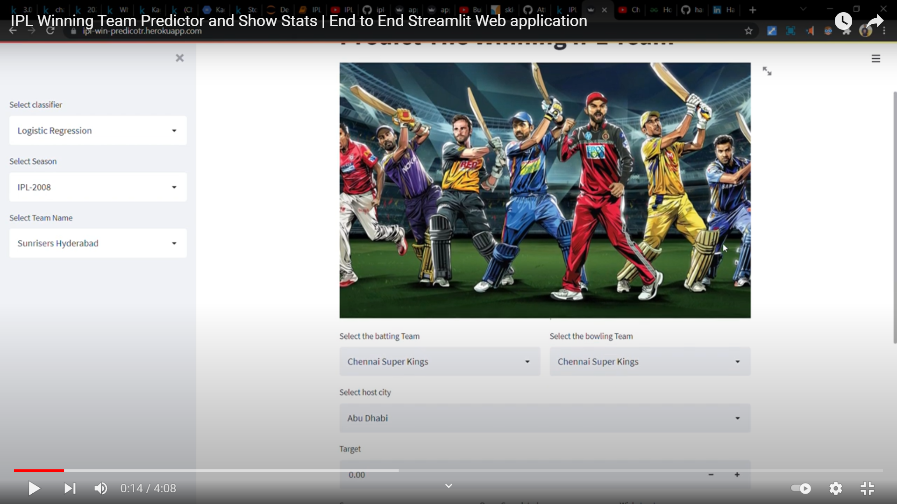

# IPL_Winning_Team_Predictor_and_show_Stats
This is an End-To-End Machine Learning Web application that Predicts the Winning IPL Team based on the 1st inning played by another team and Shows some statistics of Team Performance in IPL.

[Website Link](https://ipl-win-predicotr.herokuapp.com/)

* Implemented 3 models Logistic Regression, Random Forest and Decision Tree to Predict the Probability of Winning team.
* Show some Stats about a Particular IPL Season
* Show some stats about a particular IPL Team in Particular IPL Season.
* Build the app using Streamlit.
* Finally Deploy the app On Heroku.

